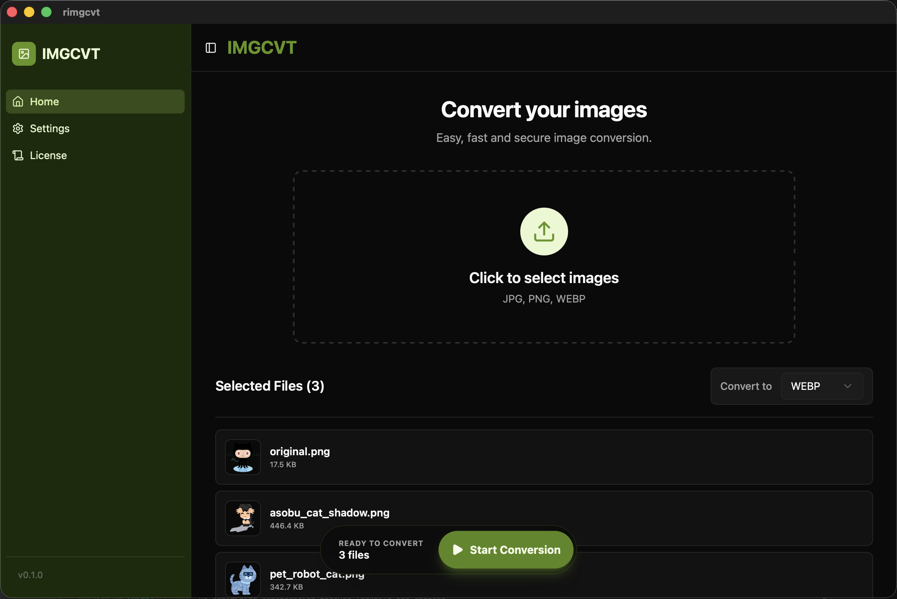

# rimgcvt

[Tauri](https://tauri.app/), [React](https://react.dev/), Rust で構築された、モダンで高速かつ軽量な画像変換アプリケーションです。

<p align="center">
  
</p>

## 機能 (Features)

- **高速変換**: Rust 製エンジンによる爆速画像処理。
- **ドラッグ & ドロップ**: 直感的なドラッグ & ドロップエリアで簡単にファイルを選択。
- **対応フォーマット**:
  - **入力**: JPG, PNG, WEBP, HEIC
  - **出力**: JPG, PNG, WEBP
- **カスタマイズ可能な設定**:
  - デフォルトの出力ディレクトリの設定。
  - ファイル名のカスタマイズ（接頭辞、競合時の解決方法）。
  - テーマ切り替え（ライト / ダーク / システム）。
- **モダンな UI**: Tailwind CSS と Shadcn/ui で構築された、クリーンでレスポンシブなユーザー体験。

## 技術スタック (Tech Stack)

- **フロントエンド**:
    - [React](https://react.dev/) (TypeScript)
    - [Tailwind CSS](https://tailwindcss.com/)
    - [Radix UI](https://www.radix-ui.com/) / [Shadcn/ui](https://ui.shadcn.com/)
    - [Lucide React](https://lucide.dev/) (Icons)
- **バックエンド / コア**:
    - [Tauri](https://tauri.app/) (v2)
    - [Rust](https://www.rust-lang.org/)
    - [image](https://github.com/image-rs/image) crate
- **ビルドツール**:
    - [Vite](https://vitejs.dev/)
    - [Bun](https://bun.sh/) (Package Manager)

## 始め方 (Getting Started)

### 前提条件 (Prerequisites)

以下のツールがインストールされていることを確認してください：

- **Node.js** (または [Bun](https://bun.sh/))
- **Rust** & Cargo ([rustup](https://rustup.rs/) 経由でインストール)
- Tauri の **システム依存関係** ([Tauri Prerequisites](https://tauri.app/v1/guides/getting-started/prerequisites) を参照)

### インストール (Installation)

1. **リポジトリをクローン:**

   ```bash
   git clone https://github.com/t1732/rimgcvt.git
   cd rimgcvt
   ```

2. **依存関係をインストール:**

   Bun を使用する場合 (推奨):
   ```bash
   bun install
   ```
   npm を使用する場合:
   ```bash
   npm install
   ```

3. **開発サーバーを起動:**

   ```bash
   bun tauri dev
   # または
   npm run tauri dev
   ```

これにより、Vite 開発サーバーが起動し、Tauri アプリケーションウィンドウが開きます。

## 使い方 (Usage)

1. **画像を選択**: 画像をウィンドウにドラッグ & ドロップするか、クリックしてファイルを選択します。
2. **フォーマットを選択**: 希望する出力フォーマット (JPG, PNG, WEBP) を選択します。
3. **変換**: "Convert" ボタンをクリックして画像を処理します。
4. **設定**: 設定メニューを使用して、出力パス、ファイル名の接頭辞、テーマを設定します。

## 本番ビルド (Building for Production)

配布用にアプリケーションをビルドするには、以下のコマンドを実行します：

```bash
bun tauri build
# または
npm run tauri build
```

ビルド成果物は `src-tauri/target/release/bundle` に生成されます。

### macOS から Windows へ交差ビルド (x86_64-pc-windows-msvc)

macOS ホストから Windows 向けにビルドする際（`cargo-xwin` を利用）、`libwebp-sys` 等の C ソースが SIMD 命令（SSSE3 / SSE4.1 / AVX / AVX2）を必要とする場合があります。これらのターゲット機能がコンパイラに渡されないと「requires target feature 'ssse3'」のようなエラーが発生します。

対処法として、ビルド前に `TARGET_CFLAGS` 環境変数を設定して CPU 機能を有効にする方法が動作します（zsh/bash の例）：

```bash
export TARGET_CFLAGS="-mssse3 -msse4.1 -mavx -mavx2"
tauri build --runner cargo-xwin --target "x86_64-pc-windows-msvc"
```

もし `clang-cl` がこれらのフラグを受け付けない場合は、クロスコンパイラとして `clang` を指定して試してください：

```bash
export CC_x86_64_pc_windows_msvc=clang
export TARGET_CFLAGS="-mssse3 -msse4.1 -mavx -mavx2"
tauri build --runner cargo-xwin --target "x86_64-pc-windows-msvc"
```

この手順は、macOS から `x86_64-pc-windows-msvc` へ交差ビルドする際の「always_inline ... requires target feature」系のコンパイルエラーを解消するために検証済みです。

## 推奨 IDE セットアップ (Recommended IDE Setup)

- [VS Code](https://code.visualstudio.com/)
- [Tauri](https://marketplace.visualstudio.com/items?itemName=tauri-apps.tauri-vscode)
- [rust-analyzer](https://marketplace.visualstudio.com/items?itemName=rust-lang.rust-analyzer)
